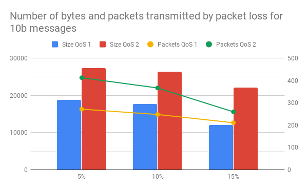
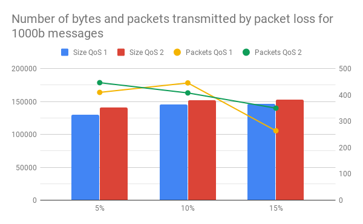
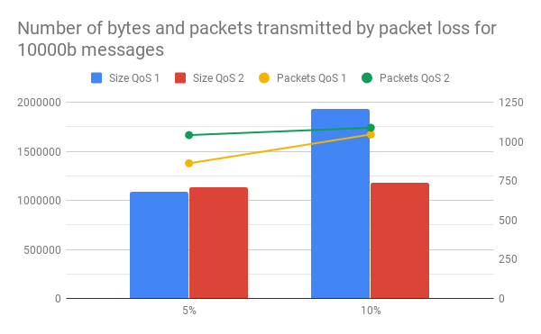

# tcc-mqtt-testing
Project for basic testing of the MQTT protocol for data transmission

---

## Results with ideal conditions

Tests were done by monitoring port 1883 using Wireshark and checking the number of bytes sent.  
The Mosquitto broker was installed on a Raspberry Pi on the same network.  
All 3 QoS levels were tested. The results for how many bytes were in the message and how many were transmitted between
the broker and client are in the table below. All sizes are in bytes.

| Message Size | Size QoS 0 | Size QoS 1 | Size QoS 2 |
|:---:|:---:|:---:|:---:|
| 0     | 133   | 189   | 307   |
| 1     | 134   | 190   | 308   |
| 10    | 143   | 199   | 317   |
| 100   | 233   | 289   | 407   |
| 1000  | 1134  | 1190  | 1308  |
| 10000 | 10314 | 10370 | 10488 |

With QoS 0, the increase in bytes sent is exactly the size of the message sent.  
With QoS 1, there was an increase in how many bytes were transmitted due to the necessity of the ACK from the broker.  
With QoS 2, there was a large increase due to the necessary handshake between broker and client.

It should be noted that with QoS 1 and 2 additional bytes would be transmitted in case of failure in transmission.

## Results with packet loss

Tests with packets loss were performed by using iptables' statistic module and dropping packets randomly, both on
`INPUT` and `OUTPUT`. For this case, QoS 0 was ignored, as it would not affect results aside from some messages
failing to arrive. To avoid chances, 100 messages were sent on each attempt, with a 0.1 second delay between each one, 
in sets of 10, 1000 and 10000 bytes each, as to break the message into multiple packets. 

### Results by total bytes transmitted

The tables below show the total bytes transmitted.

<table>
<tr><th>10 bytes messages</th><th>1000 bytes messages</th><th>10000 bytes messages</th></tr>
<tr><td>

|Packet Loss| Size QoS 1 | Size QoS 2|
|:---:|:---:|:---:|
| 5%  | 18789 | 27389 |
| 10% | 17767 | 26371 |
| 15% | 12034 | 22131 |

</td>
<td>

|Packet Loss| Size QoS 1 | Size QoS 2|
|:---:|:---:|:---:|
| 5%  | 130052 | 141294 |
| 10% | 145550 | 151910 |
| 15% | 146054 | 153051 |

</td><td>

|Packet Loss| Size QoS 1 | Size QoS 2|
|:---:|:---:|:---:|
| 5%  | 1088600 | 1133308 |
| 10% | 1935283 | 1181716 |
| 15% | unstable| unstable|

</td></tr> </table>

### Results by total packets transmitted

<table>
<tr><th>10 bytes messages</th><th>1000 bytes messages</th><th>10000 bytes messages</th></tr>
<tr><td>

|Packet Loss| Packets QoS 1 | Packets QoS 2|
|:---:|:---:|:---:|
| 5%  | 272 | 413 |
| 10% | 248 | 367 |
| 15% | 211 | 260 |

</td>
<td>

|Packet Loss| Packets QoS 1 | Packets QoS 2|
|:---:|:---:|:---:|
| 5%  | 410 | 447 |
| 10% | 446 | 408 |
| 15% | 264 | 350 |

</td><td>

|Packet Loss| Packets QoS 1 | Packets QoS 2|
|:---:|:---:|:---:|
| 5%  | 862 | 1042 |
| 10% | 1046 | 1089 |
| 15% | unstable| unstable|

</td></tr> </table>

---

The results from the tables above are displayed below in graphs for better viewing.

It must be noted that during the testing, QoS 1 many times flooded the network before receiving an answer. Using
QoS 1 and 15% packet loss turned the network unusable, as it was flooded with duplicate packets, and the tests were
interrupted as it was clear they were not stopping even after 20 minutes. Likewise, using QoS 2 with 15% packet loss
also resulted in a test that did not stop due to the amount of error handling, however it should be noted it never 
flooded the network and message exchange was done at a moderate pace.

Aside from that, QoS 2 seemed to handle packet loss surprisingly well, reducing total message size if higher packet loss
situations even after many repeated tests.

## Conclusion

The TCP stack adds quite a bit of overhead. QoS 0 should be discarded due to it's fire and forget nature.  
QoS 1 should be considered if the message sizes are small and retransmission is not costly.  
QoS 2 should be considered only if message sizes are going to be very big and retransmission is a problem.

